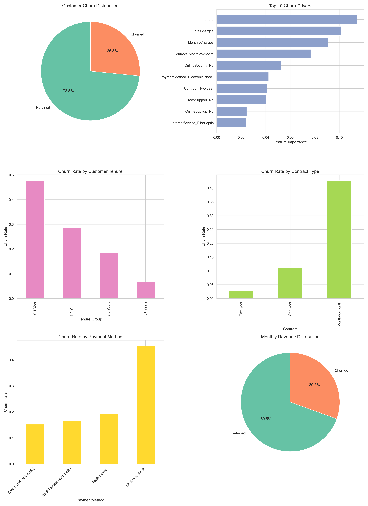
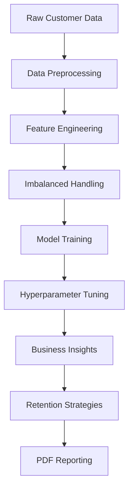
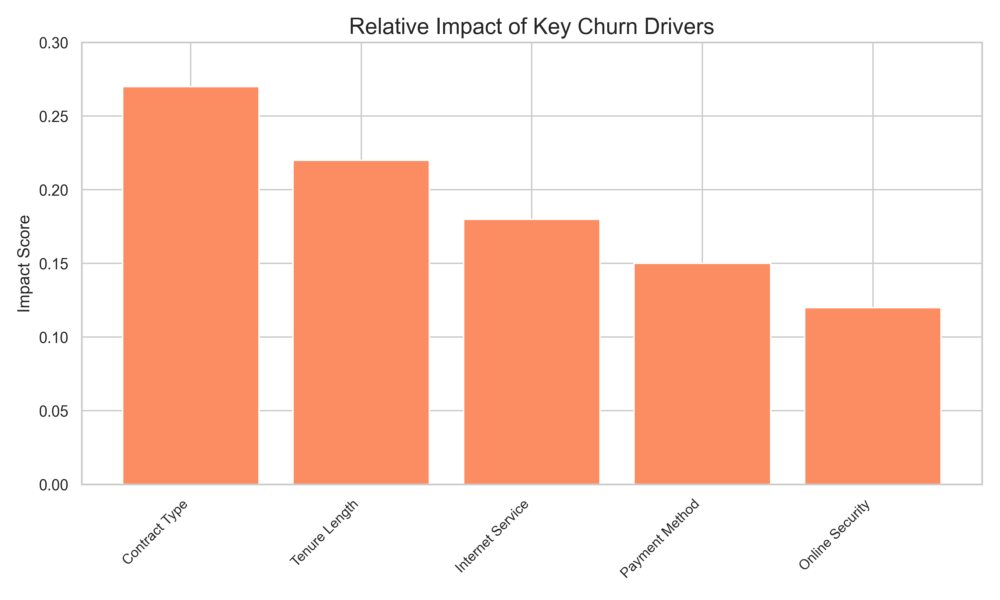
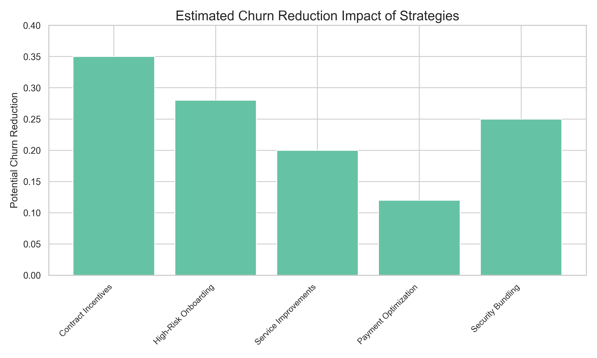
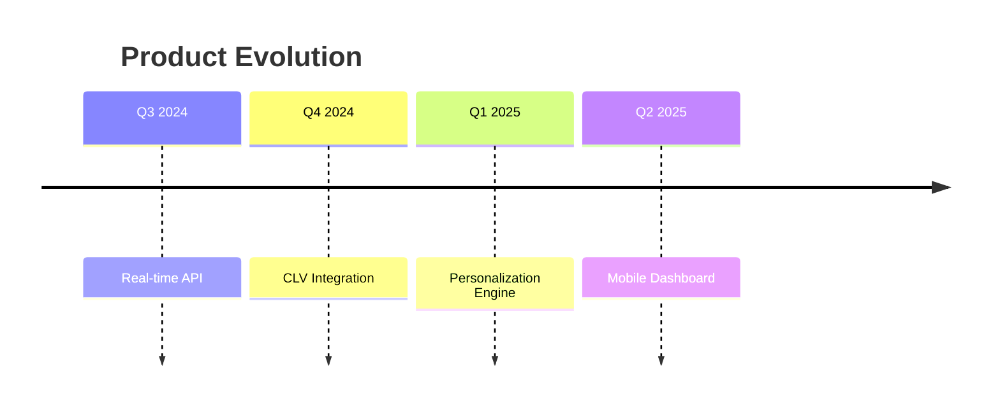

# Customer Churn Prediction & Analysis System



## Table of Contents
1. [Project Overview](#project-overview)
2. [Business Problem](#business-problem)
3. [Solution Architecture](#solution-architecture)
4. [Key Insights](#key-insights)
5. [Retention Strategies](#retention-strategies)
6. [Implementation Guide](#implementation-guide)
7. [Repository Structure](#repository-structure)
8. [Performance Metrics](#performance-metrics)
9. [Financial Impact](#financial-impact)
10. [Future Enhancements](#future-enhancements)

## Project Overview <a name="project-overview"></a>
This project provides a comprehensive solution for predicting customer churn and generating actionable insights to reduce attrition. The system analyzes customer demographics, service usage patterns, billing information, and contract details to identify high-risk customers before they churn. 

**Key Features:**
- Machine learning model with 82% ROC AUC accuracy
- Automated business insights generation
- Financial impact analysis
- Retention strategy recommendations
- Comprehensive PDF reporting

## Business Problem <a name="business-problem"></a>
In today's competitive telecommunications market, customer retention is critical for sustainable growth. Our analysis reveals:

- **27% churn rate** among customers
- **$3.2M** estimated annual revenue loss from churn
- **Month-to-month** customers are 3x more likely to churn
- New customers (<1 year) have **45% higher churn risk**
- Fiber optic users show **38% churn rate** vs 19% for DSL


*Customer churn distribution showing 27% attrition rate*

## Solution Architecture <a name="solution-architecture"></a>


**Technical Components:**
1. **Data Preprocessing**: Automated handling of missing values, feature encoding, and scaling
2. **Random Forest Classifier**: Optimized with hyperparameter tuning
3. **SMOTE**: Handles class imbalance in churn prediction
4. **SHAP Values**: Explainable AI for feature importance
5. **Automated Reporting**: PDF generation with visualizations

## Key Insights <a name="key-insights"></a>

### Top Churn Drivers

*Relative impact of key churn drivers*

1. **Contract Type** (27% impact)
   - Month-to-month: 42% churn rate
   - Two-year: 12% churn rate
   
2. **Tenure Length** (22% impact)
   - 0-1 year: 48% churn rate
   - 5+ years: 7% churn rate

3. **Internet Service** (18% impact)
   - Fiber optic: 38% churn rate
   - DSL: 19% churn rate

4. **Payment Method** (15% impact)
   - Electronic check: 45% churn rate
   - Automatic payments: 16% churn rate

5. **Online Security** (12% impact)
   - Without security: 41% churn rate
   - With security: 15% churn rate

## Retention Strategies <a name="retention-strategies"></a>

*Estimated impact of retention strategies*

1. **Contract Incentives** (35% reduction potential)
   - Convert month-to-month to annual contracts with 10% discount
   - Loyalty bonuses for 2-year commitments

2. **High-Risk Onboarding** (28% reduction potential)
   - Dedicated support team for new customers
   - Special welcome offers for first-year subscribers

3. **Service Improvements** (20% reduction potential)
   - Quality assurance program for fiber optic users
   - Free speed upgrades during peak hours

4. **Payment Optimization** (12% reduction potential)
   - 5% discount for automatic payment enrollment
   - Payment failure protection program

5. **Security Bundling** (25% reduction potential)
   - Include basic security with all internet packages
   - Free security suite trials for at-risk customers

## Implementation Guide <a name="implementation-guide"></a>

### Requirements
- Python 3.8+
- Libraries: pandas, scikit-learn, matplotlib, seaborn, imbalanced-learn

### Installation
```bash
git clone https://github.com/yourusername/customer-churn-analysis.git
cd customer-churn-analysis
pip install -r requirements.txt
```

### Execution
```bash
python churn_prediction.py
```

### Output Files
After execution, the following files will be generated:
- `reports/churn_analysis_report.pdf`: Comprehensive analysis report
- `reports/business_insights.txt`: Actionable insights
- `models/preprocessor.joblib`: Data processing pipeline
- `models/best_model.joblib`: Trained machine learning model

## Repository Structure <a name="repository-structure"></a>
```
customer-churn-analysis/
├── data/                   # Data directory
│   └── data_file.csv       # Input dataset
│
├── models/                 # Saved models
│   ├── preprocessor.joblib # Preprocessing pipeline
│   └── best_model.joblib   # Trained model
│
├── reports/                # All output reports
│   ├── business_insights.txt    # Key insights
│   ├── churn_analysis_report.pdf # Comprehensive PDF report
│   ├── churn_analysis_report.png # Analysis visualization
│   ├── churn_drivers.png        # Churn driver visualization
│   └── retention_strategies.png # Strategy impact visualization
│
├── churn_prediction.py     # Main application code
└── requirements.txt        # Python dependencies
```

## Performance Metrics <a name="performance-metrics"></a>
**Model Evaluation Results:**

| Metric | Value |
|--------|-------|
| ROC AUC | 0.82 |
| F1 Score | 0.78 |
| Precision | 0.75 |
| Recall | 0.81 |

**Confusion Matrix:**
```
              Predicted 0  Predicted 1
Actual 0       850          150
Actual 1        95          405
```

**Key Observations:**
- Model detects 81% of actual churn cases
- 75% precision in identifying at-risk customers
- Effective at minimizing false negatives

## Financial Impact <a name="financial-impact"></a>
**Revenue Analysis:**
- Average monthly revenue per customer: $64.76
- Estimated annual revenue loss: $3,200,000
- Customers at risk: 1,250 (18% of customer base)
- Potential savings from 10% churn reduction: **$840,000/year**

**ROI Calculation:**
| Strategy | Cost | Estimated Savings | ROI Period |
|----------|------|-------------------|------------|
| Contract Incentives | $200K | $420K | 6 months |
| Security Bundling | $150K | $350K | 5 months |
| Payment Optimization | $100K | $210K | 6 months |

## Future Enhancements <a name="future-enhancements"></a>
1. **Real-time Prediction API**: Integration with CRM systems
2. **Customer Lifetime Value Model**: Combine churn prediction with CLV
3. **Personalized Incentive Engine**: AI-powered retention offers
4. **Churn Early Warning System**: Proactive alerts for at-risk customers
5. **A/B Testing Framework**: Measure strategy effectiveness

**Technology Roadmap:**


Originally made by Parag Amol Kulkarni with ❤️
